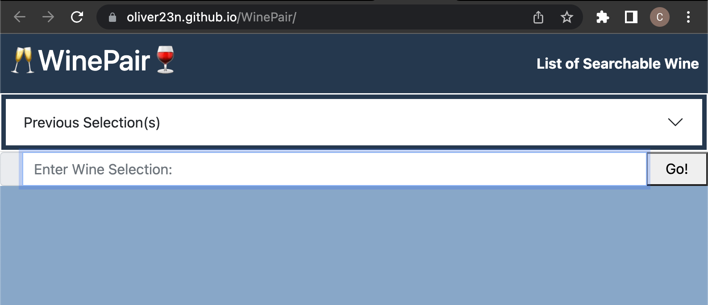
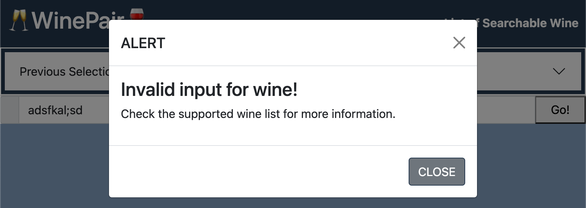
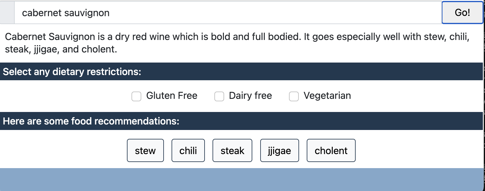

# WinePair
## The Repository

This repository contains code for a web application that returns recipes for foods that pair with a specified wine.

---

## Installation

The code may be accessed on [GitHub](https://github.com/oliver23n/WinePair) or visiting the site URL (https://oliver23n.github.io/WinePair/).

Clone the repo:
```
git clone https://github.com/oliver23n/WinePair.git
```

---

## Usage

When accessing the webpage, it displays a header with the title and a link to a modal for supported wine types, an accordion containing previously saved recipes parsed from the user's local storage, and an input field for the user to enter a wine type.



If the user inputs a wine type not supported and clicks the 'Go!' button, an alert is returned.



Upon inputting a supported wine type and clicking 'Go!', the user is shown a description of the wine, options to select dietary restrictions, and buttons for food recommendations.



Once a food recommendation is selected, as many as three cards are shown, each displaying the food title, a photo, link to the recipe, and a button to save the recipe in local storage.


---

## License

Licensed under the MIT license.

---

## Credits

Base code strategies provided by Columbia Coding Bootcamp. Other sources include:
* [Bootstrap Documentation](https://getbootstrap.com/docs/4.0/getting-started/introduction/)
* [jQuery API](https://api.jquery.com/)
* [RapidAPI: Edamam Recipe Search](https://rapidapi.com/edamam/api/recipe-search-and-diet/)
* [RapidAPI: Spoonacular](https://rapidapi.com/spoonacular/api/recipe-food-nutrition)
